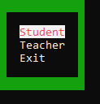
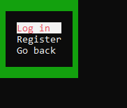
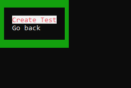
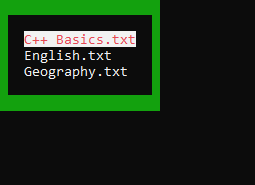
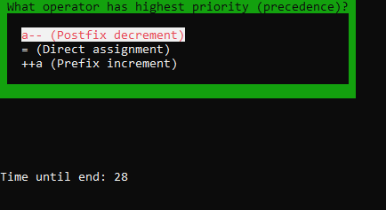
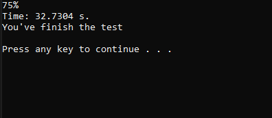

# **Testing System**

Testsing system is console application that helps creating (by teacher) and passing (by student) tests.  

It requires registration and then log in for students to pass their tests.  
Tests are saved as crypted txt files. When application starts test files are decrypting by built-in decryptor.  
After application close tests files being crypted again.  

All tests are limited by time set by test creator (teacher). If student did not end the test before time's up, the test is closing, 
and all remained questions are set as wrong answers.  
Countdown is seen below, while passing test.

Screen of Main Menu:  

Screen of Student Menu:  

Screen of Teacher Menu:  

Screen of List of Available Tests:  

Screen of Test Question:  

Screen of Test Results:  

